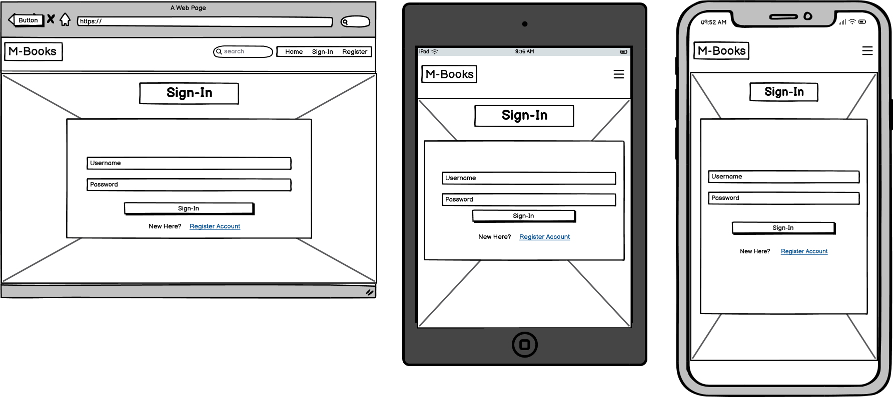
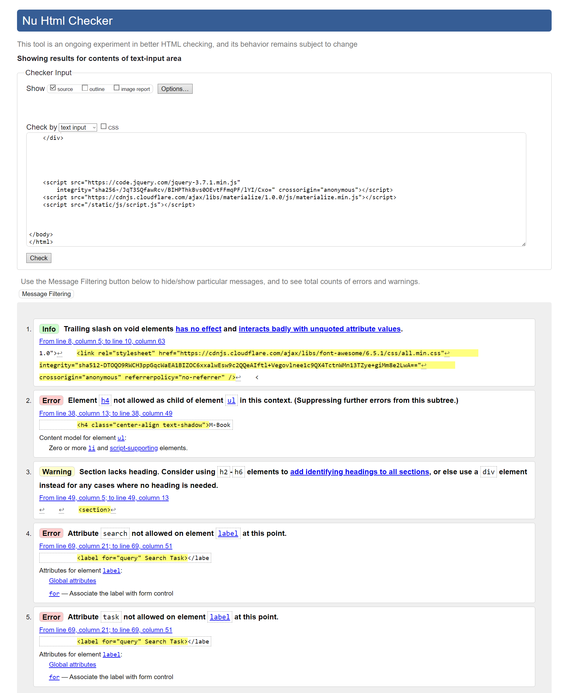
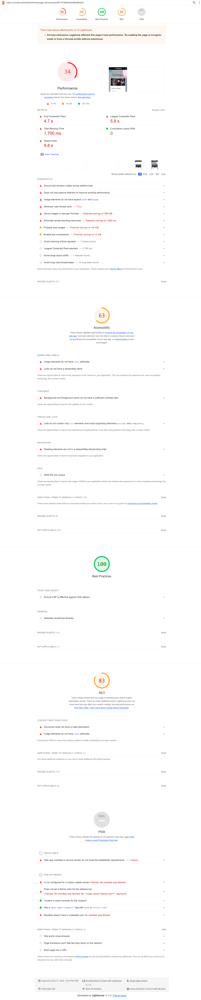
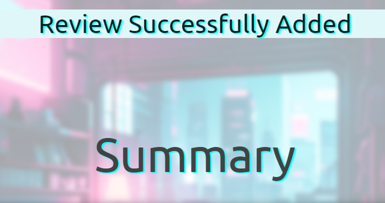
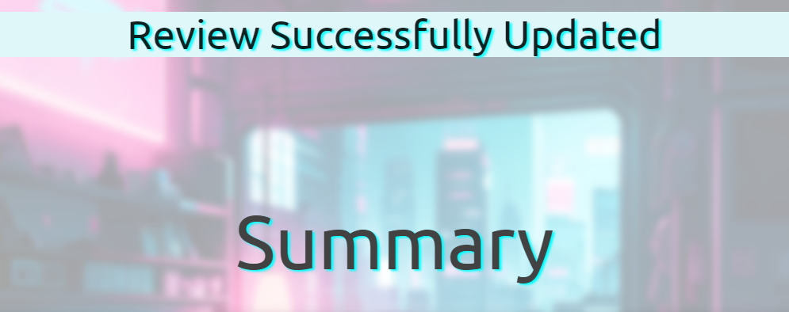

# M.Books

## Project Goals

M.Books is a web application designed that enables its users to search for Japanese Manga comic that they would like to read.

## User Goals

- All users can find Japanese Manga comic to read.
- Registered users can recommend titles that they are familiar with.
- Registered users can add, edit and remove titles to/from the website.

## Business and Development Goals

- Earn money on each book purchased via a link from the site.

## User Stories

- All users can see Home, Sign-In and Register on the navigation bar.
- All users will see an opaque background image on every page.
- Registered/Admin users who have signed in can see Home, Profile, Add Title and Sign Out in their navigation options.
- Registered/Admin users who have signed in are greeted with a welcome message on their Profile page.
- Registered/Admin users who have signed in can view all of their added Titles and Reviews on the Profile page.
- Registered/Admin users who have signed in can toggle between Titles and Review via a toggle switch.
- All user will be able to search for Manga titles titles using the search bar on the Home page.
- Users will view a list of Manga titles in alphabetical order.
- All users who click on a title will be transported to a Summary page where they can learn more.
- The Summary page will show all users a picture of the title, the year it was published and summary of the storyline.
- All users can view the reviews of the Manga titles below the summary section.
- All users that click on the back button will be transported back to the Home page
- Registered/Admin users will access buttons to Add/Edit/Delete Titles and Reviews.
- Registered/Admin users that access the Add-Title page will need to add the Title, Year of Release, Story Summary and Upload a picture of the title to add to the database.
- Registered/Admin users that add a click the Add/Edit a Review button will generate a pop form in the centre of the page that to add/edit the review.
- Registered/Admin users that click the Delete button will generate a pop-up window asking "Are you sure you want to delete {Title Name}". The user will need to press "Yes" or "No". If the user presses "No" then the window will disappear. If the user presses "Yes" then the record will be deleted redirecting the user to the Profile page and displaying the message "Record Successfully Deleted".
- Registered/Admin users that press Sign-Out will be redirected to the Sign-In page displaying the message "Successfully Signed Out".

## Features

-	**Page Consistency**
-	Each page has the “M.Books” header in the top left corner of the page. Clicking on the text transfers the user to the top of the home page.
-	Tablet and Mobile users will view the header “M.Books” in the top left corner of the page. Clicking on the text will refresh the home page.
-	**The Navigation Bar**
-	Desktop - Positioned on the right side
-	Tablet and Mobile - A burger menu with side navigation.
-	Navigation Bar (Un-Registeted Users)
- Each page will have navbar with a Home, Sign-In, Register and Search bar.
- Navigation Bar (Registered/Admin Users)
- Each page will have a Home, Sign Out, Add-Title, Contact Us.
- **Background-Image**
  - Each page will have the same opaque background image.
- **Home Page**
		- Search bar at the top of the page that allows visitors to search for a title of interest.
		- Below the search bar is a list of titles organised alphabetically.
- **Sign In page**
  - Two text input areas at the centre of the screen with Username and Password placeholder.
  - Below is a prompt "New Here?" and a link that says "Register". The link directs the user to the Register page.
  - Below the prompt is a "Sign In" button.
- **Registration Page**
  - Two text input areas at the centre of the screen with Username and Password placeholder.
  - Below is a prompt "Already Registered?" and a link that says "Sign In". The link directs the user to the Sign In page.
  - Below the prompt is a "Register" button.
- **Profile Page**
  - A toggle switch enabling the user to switch between Titles and Reviews.
  - Below is a search bar that enables the user to search for Titles/Reviews that they have added. Alternatively the user can just scroll through the list.
  - Clicking on a title directs the user to the Summary page.
- Summary Page
  - Users can view a summary of a manga title
  - Registered users have the option to add a review.
  - Registered users have the option to edit/delete Titles and Reviews added by them.
  - Admin users can add/delete all Titles and Reviews. The can only edit their own.
- **Add Title Page**
  - There are 4 input boxes for registered users to complete
		1.	Title Name
		2.	Year of Release
		3.	Summary
		4.	Provide a picture that relates to the title.
  -	Below is a "Add Title" button

##	Future Features

- Admin users will be able to Add Genre.
- Upvoting for each title which will contribute to a top 10 titles feature.
- Users will be able to reset their password.

## Typography & Colour

- **Typography**
  - Orbitron is used for the Logo and Navigation options.
  - Ubuntu is used for everything else.

-	**Colour**
  -	Black

## Wireframes

## Technology

- [Codeanywhere](https://app.codeanywhere.com/) to build the repository.
- [GitHub](https://github.com/Code-Institute-Org/ci-full-template) to push changes to the repository.
- [Heroku](https://id.heroku.com/login) to deploy the application.
- [W3C](https://validator.w3.org/) to validate the HTML and CSS code
- [jslint](https://www.jslint.com/) to validate JavaScript to validate the JavaScript code.
- [extendsclass](https://extendsclass.com/python-tester.html) to validate python code.
- [w3schools](https://www.w3schools.com/css/css_text_shadow.asp)
- [MDN web docs](https://developer.mozilla.org/en-US/)
- [Balsamiq](https://balsamiq.com/) for creating the wireframe
- [Font Awesome](https://fontawesome.com/v4/) for the icons
- [Google fonts](https://fonts.google.com/) to search for the right fonts for the website
- [Materialize](https://materializecss.com/)  to create forms and buttons.
- [MongoDB](https://mongodb.com) for the database.
- Chrome Developer Tools for device testing.
- Google Lighthouse to text site performance.

## Testing

### Code Validation

-	**HTML** 
-	**CSS** 
-	**Python** 
-	**JavaScript** 
-	**Home Page** 
-	**Sign-In Page** 
-	**Registration Page** 
-	**Profile** 
-	**Add-Title Page** 
-	**Summary Page** 

### Test Cases

- The users journey begins at the Home page. The navbar is at the top of the page with the logo on the left and the Home, Sign-In and Register options on the right. There is a blured image of a bedroom in the background. The "Manga List" header is just below the navbar and underneath is Search bar and a list of manga titles. 
- The search bar has an text input box  with a red "Reset" and blue "Search" button on the right.
- Entering a title into the search bar will render the list down and show the  related title. Pressing the reset button will refresh the page. 
- Unrelated words or titles will return a message "No Results Found".
- Pressing on the Home button directs users to the Home page.
- If the user clicks on the logo the Home page is refreshed. This is the same on every page.
- The user is directed to the Summary page when a title from the list is clicked. 
- The Summary page has a "Summary" header and below is a card that shows an image of the related title, Name of title, Year of Release, Status, Mangaka (author) and the Storyline. The image will be enlarged if the user clicks on the image. Users can get back to the home page if they press the back button located at the top left-hand side of the page. When the user scrolls further down the page they can see reviews left by registered users. 
- 
- Unrelated words or titles will return a message "No Results Found".
- Pressing on the Home button directs users to the Home page.
- If the user clicks on the logo the Home page is refreshed. This is the same on every page.
- The user is directed to the Summary page when a title from the list is clicked. 
- The Summary page has a "Summary" header and below is a card that shows an image of the related title, Name of title, Year of Release, Status, Mangaka (author) and the Storyline. The image will be enlarged if the user clicks on the image. Users can get back to the home page if they press the back button located at the top left-hand side of the page. When the user scrolls further down the page they can see reviews left by registered users. 
- 
- To register for an account users can press "Register" located on the navbar to be directed to the registration page. There are 2 input boxes for users to choose a username and a password of at least 5 characters. Below the input boxes is a green "Register" button. In the event the user wanted the Sign page, there is a prompt below the "Register" button that says "Already register Sign In" Pressing Sign In will redirect the user to the Sign In page. 
- If the user does not enter the required amount of characters, the line will turn red. Users will need to click the "Register" button to complete their registration. 
- If the username exist the page will be refreshed displaying the message "Username already exists" 
- A successful registration will direct users to the profile page displaying the message "Registration Successful!" The profile page features a card displaying the message "'Username's Profile".
- The Sign In page is very similar to the Registration page. There are 2 input boxes to enter the username and password and a green button that says "Sign In". Below the button there is a prompt "New here? Register". Pressing Register directs users to the registration page. 
- To complete a sign in users must click on the Sign In button
- Text input areas left blank will turn the area red as both areas are required for a successful sign in. 
- If the user does not enter the correct username or password then a message "Incorrect Username and/or Password entered" 
- A successful sign in will direct the user to the profile page with the message "Welcome {username}". 
- Once a user has signed in the navbar options will update to Home, Profile, Add Title and Sign Out in the navbar. 
- Clicking on Home still directs users to Home page.
- Clicking on a title still directs users to the summary page. Registered user will see everything a unregistered user can see.
- Below the story section registered users will see a blue button "Write a Review" of that title. 
- If the user is the creator of the entry then they will see a green "Edit" and a red "Delete" button. 
- Pressing the "Write a Review" button triggers a model with 2 input boxes, "Name Your Review" and "Write a Review". Below is a red "Cancel" button and a green "Add Review" button. 
- Both input boxes are required with a minimum of 5 charactor otherwise the review will not submit. Users press the "Add Review" button once this has been completed.
- Pressing the red cancel button refreshes the Summary Page.
- Pressing the green "Add Review" button directs users tot he Home page displaying a message "Review Successfully Added" 
- If the user goes back to that titles summary page they will see that their review has been added to the review section with an  "Edit" and "Delete" button . 
- If a user attempts to enter a 2nd review on the same title they will be redirected to the Home page with the message "You have already reviewed this title." 
- Pressing the green "Edit" button in the Summary section opens up a model that is pre populated with the titles existing data. At the bottom of the modal is a red "cancel" button that refreshes the page and a green "complete" button that submits the changes the user has made. 
- Once the user has pressed the "complete" button they are redirected to the Home page with a the message "Title Successfully Updated". 
- Pressing the red "Delete" button in the summary section opens up a modal that warns the user "{title} will be permanently deleted". At the botttom of the modal is a red "No" button and a green "Yes" 
- Pressing "No" refreshes the page.
- Pressing "Yes" redirects the user to the Home page with a message "Title Successfully Deleted". 
- In the review section if the user presses the green "Edit" button then a modal is opened that is prepopulated with the review data and a red "Cancel" button and a green "Complete" button. 
- The cancel button will refresh the page and the complete button will redirect the user to the Home page with the message "Review Successfully Updated" 
- Pressing the red "Delete" button in the Review section opens up a modal that warns the user "Review will be permanently deleted". At the botttom of the modal is a red "No" button and a green "Yes" 
- Pressing "No" refreshes the page.
- Pressing "Yes" redirects the user to the Home page with a message "Review Successfully Deleted". 
- Users who press the Add Title in the navbar will be directed to the Add title page. They will have to complete 6 text input areas. Name of title, Image (url), Year of release, Status, Mangaka (Author) and Story. At the bottom of the page is a green "Add Title" button and a red "Cancel" button. 
- All sections need to be completed in order to submit a new title otherwise the input area turns red. 
- If the user pressed the cancel button they are redirected to the Home page. If they press the Add Title button they are redirected to the Home page with the message "Title Successfully Added". 
- If a user submits a title that already existing the add title page will refresh with a message "Title alreday exists" 
- If the user presses Sign Out on the navbar they are directed to the Sign In page with the message "You have signed out" 

### Fixed Bugs

-	**Accessing individual Titles on the Summary page**: I  wanted  to  make  it  so when the user clicks a title, they would be transported to the summary screen with further deals of that title.

However,  what  displayed  was a 404 message.

I rewatched the course content “Bind the data to the Edit_task form” and with some trial & error and the help of Jinja I was able to deduce that because href in titles.html was wrapped in a for loop I needed to change titles.id to title.id. This solved the problem.

-	**Getting related reviews to show up on the Summary Page:** I wanted reviews to show up on the summary page only if they related to the book title. At first on clicking a title, all of the reviews from the reviews dictionary were being pulled, which is the opposite of what I wanted. I watched a video on [YouTube](https://youtu.be/rtYoUDEz4wo?si=yXGBtvS9Ege95-tN) that helped me understand I could make the title ObjectId part of the review data. Then I could use the ObjectId as a parameter to call all the reviews related to a specific book title.
Initially, my @app.route(“/summary”) was set up to find ObjectId(titles_id), however, the  @app.route(“/add_review”) review variable was adding “title_id”: title_id.
 When the summary function was being called the entry couldn’t be found because it didn’t exist, therefore nothing happened. I put my frustrations to one side and focused on other parts of the application. I came back a looked at the code and saw where the error was.

I changed the title_id in the review variable in the @app.route(“/summary”) function to add “title_id”: ObjectId(title_id). This immediately solved the problem.

### Browser Testing

- **Chrome** 
- **Edge** 
- **Firefox** 
- **Opera** 

## Deployment

### Codeanywhere

### Heroku
